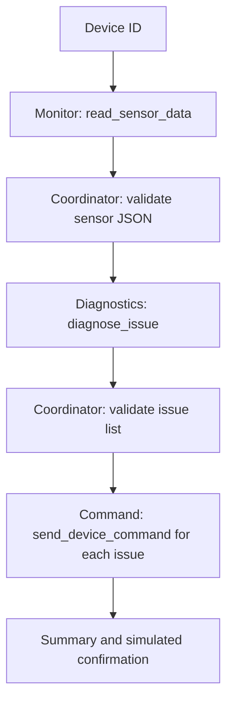

# Learning guide: three-agent smart home coordinator

This project is a small, runnable exercise in coordinating specialized AI agents. The sensor readings, diagnostic rules, and device command responses are sample data in Python. The agents call Amazon Bedrock through the Strands Agents SDK, so running the application requires AWS access and can incur model usage charges. The command tool **simulates** dispatch; it does not connect to physical devices.

## 1. What you will learn

1. Give each specialist its own `BedrockModel`, instructions, and tool.
2. Pass structured JSON from one agent to the next.
3. Validate each result before progressing to a corrective action.
4. Test the same Python pipeline in a terminal and a local web browser.
5. Troubleshoot local Python, AWS credentials, Bedrock access, and model output separately.

### Data flow



The coordinator owns the order of operations. Each agent can call only its assigned tool. The sample tool implementations and data came with the exercise; the six TODOs supply agent construction and handoffs.

## 2. Project files

| File | Purpose |
| --- | --- |
| `smart_home_device_mgmt.py` | Three agent builders, coordinator, sample data, tools, and terminal run |
| `web_test.py` | Local HTTP interface that invokes the same coordinator |
| `requirements.txt` | Python dependencies |
| `.env.example` | Nonsecret model and region configuration template |
| `.gitignore` | Keeps `.env` and Python local files out of Git |
| `architecture.svg` | Starter diagram |

GitHub displays source files; it does not execute this Python server. Run the project on your computer or in a development environment with AWS access.

## 3. Get the project on Windows

Install Python 3.11 or newer and AWS CLI v2. Open **PowerShell**:

```powershell
cd "C:\Users\mwqas\OneDrive\Desktop"
git clone https://github.com/mwqas/smart_home_device_mgmt.git
cd .\smart_home_device_mgmt
py -3 --version
aws --version
```

If you already downloaded the files into `C:\Users\mwqas\OneDrive\Desktop\starter`, you may use that directory instead. To refresh a Git clone, use `git pull`; for a manually downloaded copy, get the latest files from GitHub. Do not run `git clone` over an existing folder with the same name.

Create an isolated Python environment and install dependencies:

```powershell
py -3 -m venv .venv
.\.venv\Scripts\python.exe -m pip install -r requirements.txt
Copy-Item .env.example .env
```

Using `.venv\Scripts\python.exe` directly avoids PowerShell script execution policy issues. If `py -3` is unavailable, try `python` after checking `python --version`.

## 4. Authenticate to AWS

AWS credentials belong on the machine running Python. Connecting AWS to ChatGPT does **not** put credentials in PowerShell. The `.env` file selects region and model; it is not a credential file.

In the Udacity lab, use **Load AWS Credentials** in the sidebar, then run the project in that lab's terminal. On your own Windows computer, use the AWS CLI login or your organization's approved AWS profile:

```powershell
aws login
aws sts get-caller-identity
```

For a named profile, use `aws sts get-caller-identity --profile YOUR_PROFILE` and set `$env:AWS_PROFILE="YOUR_PROFILE"` in the terminal running Python. If login is unavailable for your account, follow your AWS administrator's SSO/profile setup. Never copy access keys into this repository, screenshots, or chat.

A successful `get-caller-identity` verifies authentication. It does not by itself prove permission to invoke a Bedrock model.

## 5. Choose a Bedrock model

Open `.env` in your editor. This project's tested configuration is:

```dotenv
AWS_REGION=us-east-1
MODEL_ID=us.anthropic.claude-sonnet-4-5-20250929-v1:0
```

The model ID is a US cross-region inference profile. Model availability and permissions vary by account and region. Inspect available profiles:

```powershell
aws bedrock list-inference-profiles --region us-east-1 --query "inferenceProfileSummaries[].inferenceProfileId" --output table
```

Choose an ID your account may invoke, then keep the same region in `.env`. For Anthropic models on the Bedrock runtime, AWS requires a one-time first-use form. In the AWS console, go to **Amazon Bedrock → Model catalog**, select the Anthropic model, and complete the requested use-case details if prompted. A personal GitHub project URL can describe a student use case. Your identity also needs permission to invoke the model and its inference profile; an administrator may need to grant it. See [AWS model access](https://docs.aws.amazon.com/bedrock/latest/userguide/model-access.html) and [inference profiles](https://docs.aws.amazon.com/bedrock/latest/userguide/inference-profiles-support.html).

The code explicitly sets `max_tokens=1024` on each `BedrockModel`. Model calls are billable; use the three sample devices only as often as needed while learning.

## 6. Understand the six TODOs

| TODO | Location | What it does |
| --- | --- | --- |
| 1 | `build_device_monitor` | Creates a model, prompt, and `read_sensor_data` tool for the Monitor |
| 2 | `build_diagnostics_agent` | Creates a model, prompt, and `diagnose_issue` tool for Diagnostics |
| 3 | `build_command_agent` | Creates a model, prompt, and `send_device_command` tool for Command |
| 4 | `run_device_pipeline` | Invokes Monitor, parses JSON, verifies matching device ID and readings |
| 5 | `run_device_pipeline` | Sends the exact sensor JSON to Diagnostics, verifies issue list |
| 6 | `run_device_pipeline` | Invokes Command once for each issue, validates confirmation |

The tool `diagnose_issue` compares sample readings to these rules:

| Rule | Condition | Sample device | Corrective action |
| --- | --- | --- | --- |
| `overheating` | temperature > 85 | DEV-001: 92.5 | `restart_device` |
| `firmware_issue` | connectivity < 20 | DEV-002: 12 | `push_firmware_update` |
| `low_battery` | battery < 10 | DEV-003: 7 | `send_recharge_notification` |

The name `firmware_issue` is a label in the exercise's fixed rules; low connectivity alone is not proof of faulty firmware in a real system.

Agent responses may be wrapped in a Markdown JSON fence. `clean_response` removes that optional fence, after which the coordinator parses and validates JSON. The coordinator raises an error on a malformed handoff rather than reporting a successful command.

## 7. Run all three terminal scenarios

From the project directory:

```powershell
.\.venv\Scripts\python.exe smart_home_device_mgmt.py
```

Check for three summaries:

```text
DEV-001  overheating     restart_device
DEV-002  firmware_issue  push_firmware_update
DEV-003  low_battery     send_recharge_notification
```

Each scenario invokes Bedrock agents. The actual wording of model output and timing may vary, while the issue and action should match the sample rules.

## 8. Test in a browser

Start the server in the same PowerShell window that has AWS access:

```powershell
.\.venv\Scripts\python.exe web_test.py
```

Open [http://127.0.0.1:8765](http://127.0.0.1:8765) on that computer. Click each of the three device buttons. The page shows its issue, simulated dispatched action, and expandable JSON. Keep the terminal open while testing; press **Ctrl+C** to stop the server. The page works locally only; the GitHub repository link is not a hosted version of the app.

If Python runs in a remote lab, use that environment's port forwarding or preview for port 8765. The server binds to `127.0.0.1`, so a remote preview may require a lab-supported bind/forward configuration.

## 9. Troubleshooting

| Symptom | What to check |
| --- | --- |
| `python` or `py` not found | Install Python 3.11+ and open a new terminal; verify `py -3 --version`. |
| `ModuleNotFoundError: strands` | Install with the same interpreter used to run the script: `.\.venv\Scripts\python.exe -m pip install -r requirements.txt`. |
| `aws` not found | Install AWS CLI v2, reopen PowerShell, and check `aws --version`. |
| Missing or expired credentials | Run `aws sts get-caller-identity`; refresh the lab credentials or local login. |
| `AccessDeniedException` | Verify invoke permission, first-use form, region, model/profile ID, and any organization policy. Read the exact error text. |
| Model ID not found or on-demand unsupported | List inference profiles in the selected region and set `MODEL_ID` to an accessible profile ID. |
| Throttling or timeout | Wait and retry; `max_tokens` is already limited. Check AWS quotas if recurring. |
| JSON parsing error | Ensure the latest `smart_home_device_mgmt.py` includes the fenced-JSON cleanup; inspect the returned text without sharing credentials. |
| Browser cannot open | Keep `web_test.py` running, use the same computer, and verify port 8765 is free. |
| Browser reports 500 | Read the PowerShell traceback/error; usually the Bedrock credentials, permission, or model call failed. |

## 10. Safe next experiments

- Change a copied sample sensor value across one threshold and observe the diagnosis.
- Add a healthy sample device and verify the Command stage is skipped.
- Add a reading that triggers two issues and check that two simulated commands are returned.
- For a real deployment, replace sample readings and simulated commands with authenticated device integrations, add authorization and idempotency, and verify effects before reporting success. Do not use this tutorial's simulated command response as proof that a physical device changed state.

## References

- [Strands Agents documentation](https://strandsagents.com/)
- [AWS Bedrock model access](https://docs.aws.amazon.com/bedrock/latest/userguide/model-access.html)
- [AWS Bedrock inference profiles](https://docs.aws.amazon.com/bedrock/latest/userguide/inference-profiles-support.html)
- [AWS CLI list inference profiles](https://docs.aws.amazon.com/cli/latest/reference/bedrock/list-inference-profiles.html)
