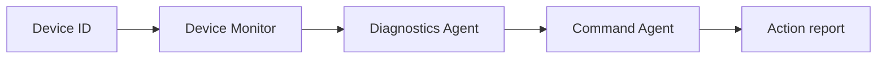

# Smart Home Device Management

A three-agent smart home exercise using the [Strands Agents SDK](https://strandsagents.com/) and Amazon Bedrock. A coordinator passes device telemetry through a monitor, diagnostician, and command agent.



Each specialist has its own `BedrockModel`, system prompt, and course-provided tool. The monitor reads sample telemetry, the diagnostician applies fixed thresholds, and the command agent returns a **simulated** corrective-action confirmation. No physical devices are controlled.

| Device | Issue | Action |
| --- | --- | --- |
| DEV-001 · Living Room Thermostat | `overheating` | `restart_device` |
| DEV-002 · Front Door Smart Lock | `firmware_issue` | `push_firmware_update` |
| DEV-003 · Doorbell Camera | `low_battery` | `send_recharge_notification` |

## Setup

Use Python 3.11 or later and AWS credentials with Bedrock model access. In the Udacity lab, use **Load AWS Credentials**. From this directory:

```bash
python -m pip install -r requirements.txt
cp .env.example .env
python smart_home_device_mgmt.py
```

On Windows Command Prompt, use `copy .env.example .env`; on PowerShell, use `Copy-Item .env.example .env`. Set `MODEL_ID` and `AWS_REGION` in `.env` to a model available to your account and lab region. Do not commit credentials.

The console loops through three sample devices and prints the diagnosed issue and action. Each Bedrock call may incur charges.

## Browser test

```bash
python web_test.py
```

Open [http://127.0.0.1:8765](http://127.0.0.1:8765) on the same computer that runs Python, then select a device. If Python runs in a remote Udacity lab, forward port `8765` using the lab's preview feature. The browser test calls the same three-agent pipeline; it does not replace AWS credentials or Bedrock access.

## Files

- `smart_home_device_mgmt.py` — completed six-TODO coordinator exercise.
- `web_test.py` — local browser interface.
- `architecture.svg` — starter architecture diagram.
- `.env.example` — configuration template.

The starter's sample data and tool implementations are preserved. Bedrock agent responses are expected to be JSON; a malformed model response raises an error rather than silently dispatching a command.
