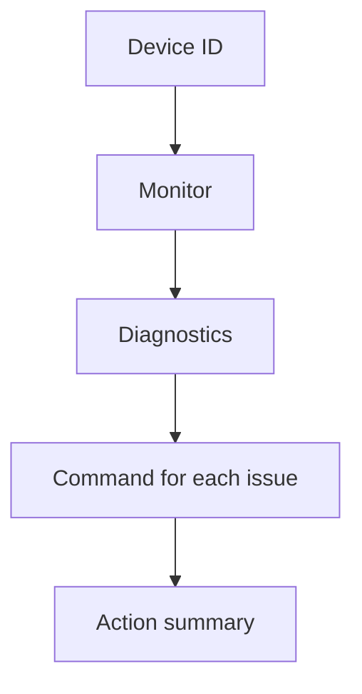

# Smart Home Device Management

A hands-on three-agent coordinator exercise using [Strands Agents](https://strandsagents.com/) and Amazon Bedrock. The Monitor reads sample telemetry, Diagnostics applies fixed rules, and Command confirms a **simulated** corrective action. No physical device is controlled.

**Start here:** [Step-by-step learning guide](LEARNING_GUIDE.md) — Windows setup, AWS credentials, model access, all six TODOs, terminal and browser testing, expected output, and troubleshooting.



| Device | Expected issue | Simulated action |
| --- | --- | --- |
| DEV-001 · Thermostat | `overheating` | `restart_device` |
| DEV-002 · Smart lock | `firmware_issue` | `push_firmware_update` |
| DEV-003 · Doorbell camera | `low_battery` | `send_recharge_notification` |

## Quick start (PowerShell)

Requires Python 3.11+, AWS CLI credentials, Bedrock invoke permission, and access to the chosen model. See the [learning guide](LEARNING_GUIDE.md) for the AWS steps.

```powershell
git clone https://github.com/mwqas/smart_home_device_mgmt.git
cd smart_home_device_mgmt
py -3 -m venv .venv
.\.venv\Scripts\python.exe -m pip install -r requirements.txt
Copy-Item .env.example .env
aws sts get-caller-identity
.\.venv\Scripts\python.exe smart_home_device_mgmt.py
```

The template selects `us-east-1` and a Claude Sonnet inference profile that worked during this project's test. Edit `.env` if your AWS account uses another permitted model or region. Do not commit credentials. AWS model calls can incur charges.

For the local browser interface, run:

```powershell
.\.venv\Scripts\python.exe web_test.py
```

Open [http://127.0.0.1:8765](http://127.0.0.1:8765) on the computer running Python. GitHub shows the code but does not host this Python app.

## Files

- [`LEARNING_GUIDE.md`](LEARNING_GUIDE.md): complete walkthrough.
- [`smart_home_device_mgmt.py`](smart_home_device_mgmt.py): completed six-TODO exercise and terminal runner.
- [`web_test.py`](web_test.py): local browser runner using the same coordinator.
- [`.env.example`](.env.example): configuration template.
- [`requirements.txt`](requirements.txt): Python packages.
- [`architecture.svg`](architecture.svg): starter architecture diagram.
